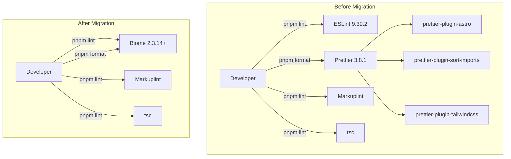
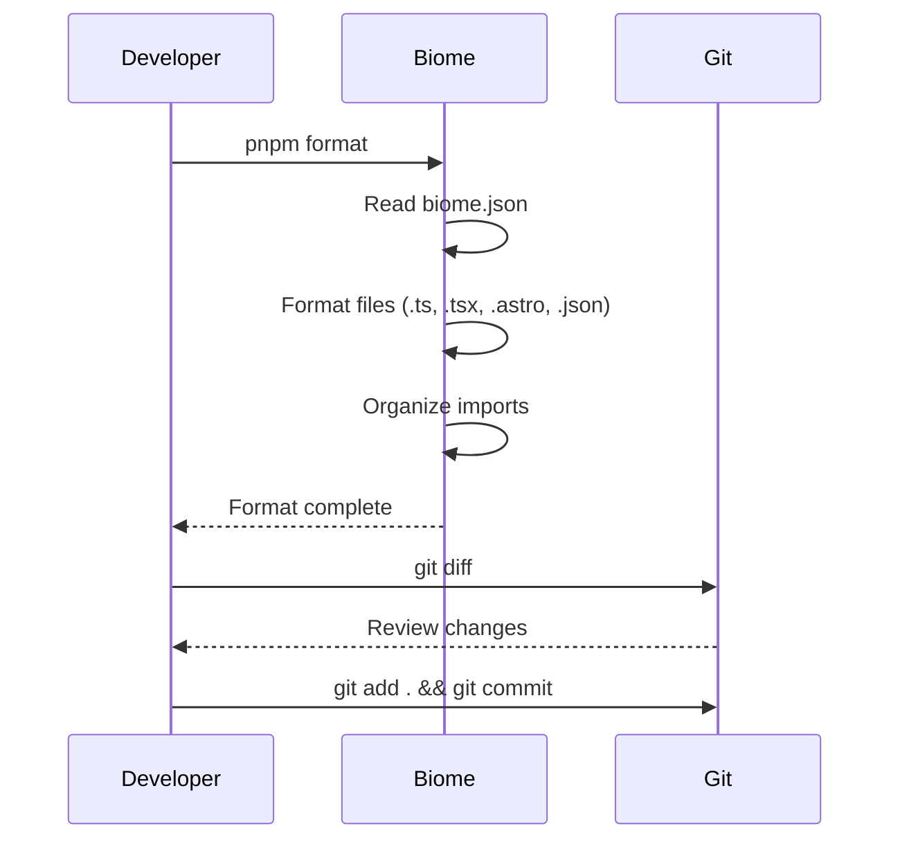
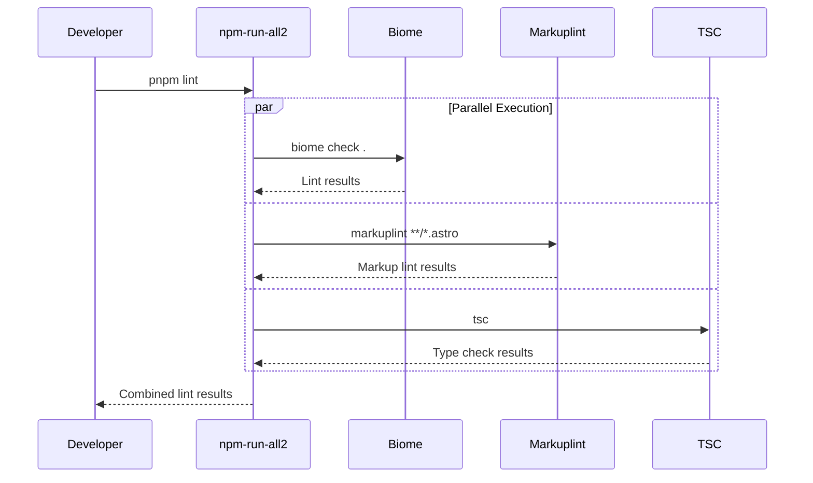
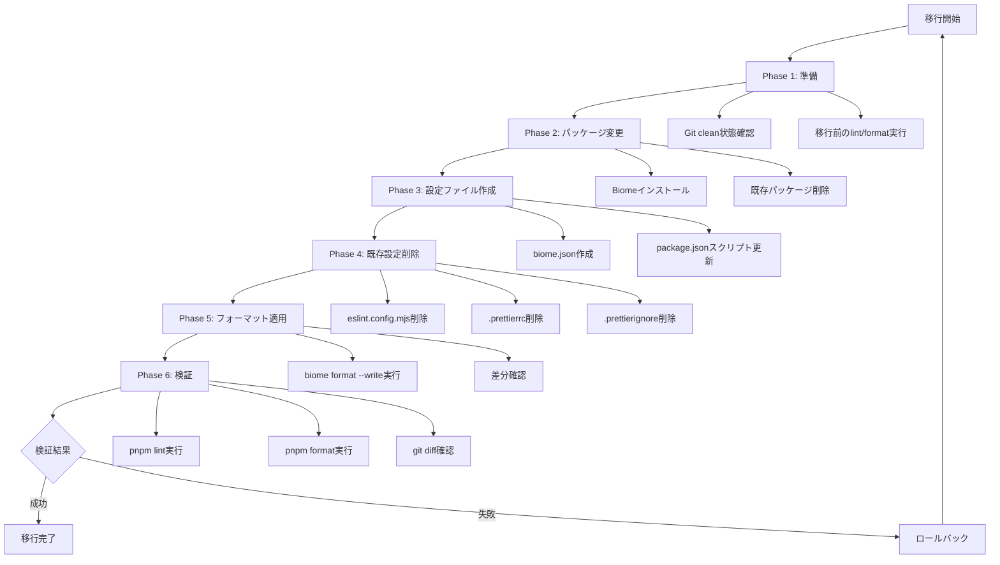

# Technical Design Document: Biome移行

## Overview

本機能は、現在のESLint + Prettier構成をBiome（オールインワンツールチェーン）に置き換え、開発環境の統合とパフォーマンス向上を実現します。

**Purpose**: 複数のツール（ESLint、Prettier、3つのPrettierプラグイン）を単一のBiomeツールに統合し、ツールチェーンの保守性と実行速度を改善します。

**Users**: 開発者が日常的に使用するlint/formatコマンドの実行速度が向上し、設定ファイルの管理が簡素化されます。

**Impact**: 既存のESLint/Prettier設定ファイル（`eslint.config.mjs`, `.prettierrc`, `.prettierignore`）を削除し、`biome.json`に統合します。package.jsonのスクリプト（`lint:eslint`, `format`）をBiomeコマンドに置き換えます。

### Goals

- ESLintとPrettierのパッケージ/設定ファイルを削除し、Biomeに統合する
- 既存のlint/format機能を維持したまま、実行速度を50%以上改善する
- Import順序整理機能を`organizeImports`で再現する
- Astro/TypeScriptファイルのフォーマット/リント品質を維持する

### Non-Goals

- Tailwind CSSクラス順序の自動整理（Biomeは現時点で非サポート、手動管理を受容）
- Markuplintの置き換え（マークアップ品質チェックは継続使用）
- TypeScript型チェック（tsc）の置き換え（既存ワークフローを維持）
- 既存コードのロジック変更（フォーマットのみ）

## Architecture

### Existing Architecture Analysis

現在のツールチェーン構成:
- **Linter**: ESLint 9.39.2（ignoresパターンのみ、実質的なリントルールなし）
- **Formatter**: Prettier 3.8.1 + 3つのプラグイン
  - `prettier-plugin-astro`: Astroファイルのフォーマット
  - `@trivago/prettier-plugin-sort-imports`: Import順序自動整理
  - `prettier-plugin-tailwindcss`: Tailwindクラス順序整理
- **Markup Quality**: Markuplint（Astro対応、継続使用）
- **Type Check**: tsc（TypeScript Compiler、継続使用）

統合ポイント:
- package.jsonスクリプト: `lint:eslint`, `format`, `lint` (run-s経由)
- 設定ファイル: `eslint.config.mjs`, `.prettierrc`, `.prettierignore`
- 対象ファイル: TypeScript (.ts, .tsx), Astro (.astro), JSON (.json)

### Architecture Pattern & Boundary Map



**Architecture Integration**:
- **選択パターン**: Drop-in Replacement — 既存機能を1:1でBiomeに移行
- **ドメイン境界**:
  - **Biome**: コード品質（lint + format + import整理）
  - **Markuplint**: マークアップ品質（Astro固有のチェック）
  - **tsc**: 型チェック（TypeScript Compiler）
- **既存パターン維持**: run-s による並列lint実行（`lint:biome`, `lint:markup`, `lint:tsc`）
- **新コンポーネント不要**: 既存ツールを単純に置き換え
- **Steering準拠**: TypeScript strict mode優先、型安全性維持

### Technology Stack

| Layer | Choice / Version | Role in Feature | Notes |
|-------|------------------|-----------------|-------|
| Toolchain | @biomejs/biome@2.3.14+ | リンター/フォーマッター/import整理 | Rustベース、Prettier 97%互換、TypeScript 5.6対応 |
| Runtime | Node.js 22.22.0+ | 実行環境 | 既存要件を維持 |
| Package Manager | pnpm 10.x | パッケージ管理 | 既存構成を維持 |

**削除パッケージ**:
- eslint@9.39.2
- prettier@3.8.1
- prettier-plugin-astro@0.14.1
- @trivago/prettier-plugin-sort-imports@6.0.2
- prettier-plugin-tailwindcss@0.7.2

## Requirements Traceability

| Requirement | Summary | Components | Interfaces | Flows |
|-------------|---------|------------|------------|-------|
| 1.1, 1.2, 1.3 | Biomeパッケージインストール、既存パッケージ削除 | Package Manager | package.json | — |
| 2.1, 2.2, 2.3, 2.4, 2.5, 2.6 | Biome設定ファイル作成 | Biome Configuration | biome.json | — |
| 3.1, 3.2, 3.3 | 既存設定ファイル削除 | File System | eslint.config.mjs, .prettierrc, .prettierignore | — |
| 4.1, 4.2, 4.3, 4.4 | package.jsonスクリプト更新 | Package Scripts | package.json scripts | — |
| 5.1, 5.2, 5.3 | 既存コードフォーマット適用 | Biome Formatter | CLI | Format Workflow |
| 6.1, 6.2, 6.3, 6.4 | 開発ワークフロー検証 | Developer Workflow | CLI | Lint/Format Workflow |
| 7.1, 7.2, 7.3 | ドキュメント更新 | Documentation | tech.md, README.md | — |

## Components and Interfaces

| Component | Domain/Layer | Intent | Req Coverage | Key Dependencies | Contracts |
|-----------|--------------|--------|--------------|------------------|-----------|
| Biome Configuration | Toolchain Config | Biome設定ファイル（biome.json）を生成し、既存ルールを再現 | 2.1-2.6 | tsconfig.paths.json (P1) | Config File |
| Package Manager | Build System | Biomeパッケージ追加、既存パッケージ削除 | 1.1-1.3 | pnpm (P0) | package.json |
| File System Cleanup | Migration Process | 不要設定ファイル削除 | 3.1-3.3 | Git (P1) | File Operations |
| Package Scripts | Build System | lint/formatスクリプトをBiomeに置き換え | 4.1-4.4 | npm-run-all2 (P1) | package.json scripts |
| Format Workflow | Migration Process | 全ファイルにBiomeフォーマット適用 | 5.1-5.3 | Biome CLI (P0) | CLI |
| Documentation Update | Docs | Steering/READMEドキュメント更新 | 7.1-7.3 | — | Markdown |

### Toolchain Configuration

#### Biome Configuration

| Field | Detail |
|-------|--------|
| Intent | Biome設定ファイル（biome.json）を生成し、既存ESLint/Prettier設定と同等の機能を実現 |
| Requirements | 2.1, 2.2, 2.3, 2.4, 2.5, 2.6 |

**Responsibilities & Constraints**
- 既存のignoresパターンをBiome形式に変換
- Astro/TypeScript/JSONファイルタイプのフォーマット設定
- Import順序整理ルール（organizeImports）の定義
- TypeScript strict mode対応のリントルール設定

**Dependencies**
- Inbound: tsconfig.paths.json — エイリアスパス定義 (P1)
- External: Biome公式ドキュメント — 設定スキーマ参照 (P2)

**Contracts**: Config File [x]

##### Config File Contract

**biome.json構造**:
```typescript
interface BiomeConfig {
  $schema: string;
  files: {
    ignore: string[];       // 除外パターン
    include: string[];      // 対象ファイル
  };
  formatter: {
    enabled: boolean;
    indentStyle: "space" | "tab";
    indentWidth: number;
  };
  linter: {
    enabled: boolean;
    rules: {
      recommended: boolean;
      // TypeScript strict対応ルール
    };
  };
  organizeImports: {
    enabled: boolean;
    groups: string[][];     // Import順序グループ定義
  };
}
```

**設定内容**:
- **files.ignore**: `.next/**, out/**, build/**, dist/**, next-env.d.ts, storybook-static/**, node_modules/**, pnpm-lock.yaml, coverage`
- **files.include**: `**/*.ts, **/*.tsx, **/*.astro, **/*.json`
- **organizeImports.groups**:
  ```json
  [
    [":PACKAGE:"],           // サードパーティモジュール
    [":BLANK_LINE:"],
    ["\\./.*"],              // ローカル相対パス
    [":BLANK_LINE:"],
    ["~/.*"]                 // エイリアスパス (~/)
  ]
  ```

**実装ノート**:
- **Integration**: tsconfig.paths.jsonの`~/`エイリアス定義を参照し、`:ALIAS:`グループで認識
- **Validation**: 移行後に代表的なファイルでimport順序を検証、既存順序と一致することを確認
- **Risks**: Astro実験的サポートにより一部構文でエラーの可能性（Markuplintで補完）

### Build System

#### Package Manager

| Field | Detail |
|-------|--------|
| Intent | Biomeパッケージをインストールし、既存のESLint/Prettierパッケージを削除 |
| Requirements | 1.1, 1.2, 1.3 |

**Responsibilities & Constraints**
- `@biomejs/biome`をdevDependenciesに追加（最新安定版）
- ESLint/Prettier関連5パッケージをpackage.jsonから削除
- pnpm installを実行し、node_modules/pnpm-lock.yamlを更新

**Dependencies**
- External: pnpm — パッケージマネージャー (P0)
- External: @biomejs/biome — Biomeツールチェーン (P0)

**Contracts**: package.json [x]

##### package.json Contract

**変更内容**:
- **追加**: `"@biomejs/biome": "^2.3.14"` (devDependencies)
- **削除**:
  - `"eslint": "9.39.2"`
  - `"prettier": "3.8.1"`
  - `"prettier-plugin-astro": "0.14.1"`
  - `"@trivago/prettier-plugin-sort-imports": "6.0.2"`
  - `"prettier-plugin-tailwindcss": "0.7.2"`

**実装ノート**:
- **Integration**: `pnpm add -D @biomejs/biome && pnpm remove eslint prettier prettier-plugin-astro @trivago/prettier-plugin-sort-imports prettier-plugin-tailwindcss`
- **Validation**: package.jsonの変更を確認、pnpm-lock.yamlが正しく更新されることを検証
- **Risks**: パッケージ削除により他の依存関係が影響を受ける可能性（事前にdependency treeを確認）

#### Package Scripts

| Field | Detail |
|-------|--------|
| Intent | package.jsonのlint/formatスクリプトをBiomeコマンドに置き換え |
| Requirements | 4.1, 4.2, 4.3, 4.4 |

**Responsibilities & Constraints**
- `lint:eslint`を`lint:biome`に置き換え
- `format`スクリプトをBiomeコマンドに更新
- `lint`スクリプト（run-s経由）でBiome、Markuplint、tscを並列実行

**Dependencies**
- Inbound: npm-run-all2 — 並列スクリプト実行 (P1)
- Outbound: Biome CLI — lint/formatコマンド (P0)

**Contracts**: package.json scripts [x]

##### package.json scripts Contract

**変更内容**:
```json
{
  "scripts": {
    "lint": "run-s -c 'lint:*'",
    "lint:biome": "biome check .",        // 旧: "lint:eslint": "eslint ."
    "lint:markup": "markuplint **/*.astro",
    "lint:tsc": "tsc",
    "format": "biome format --write ."    // 旧: "prettier --write ."
  }
}
```

**実装ノート**:
- **Integration**: run-sが`lint:biome`, `lint:markup`, `lint:tsc`を並列実行
- **Validation**: `pnpm lint`および`pnpm format`の実行結果を確認
- **Risks**: Biomeコマンドのexit codeがrun-sと互換性がない場合、CIパイプラインで失敗する可能性

### Migration Process

#### File System Cleanup

| Field | Detail |
|-------|--------|
| Intent | 不要になったESLint/Prettier設定ファイルを削除 |
| Requirements | 3.1, 3.2, 3.3 |

**Responsibilities & Constraints**
- `eslint.config.mjs`, `.prettierrc`, `.prettierignore`を削除
- Git管理下のファイルであることを確認してから削除

**Dependencies**
- External: Git — バージョン管理システム (P1)

**Contracts**: File Operations [x]

##### File Operations Contract

**削除ファイル**:
- `eslint.config.mjs`
- `.prettierrc`
- `.prettierignore`

**実装ノート**:
- **Integration**: `git rm eslint.config.mjs .prettierrc .prettierignore`（Git管理下の確認と削除を同時実行）
- **Validation**: 削除後にgit statusで確認
- **Risks**: 誤って必要なファイルを削除する可能性（削除前にバックアップまたはGit commitを推奨）

#### Format Workflow

| Field | Detail |
|-------|--------|
| Intent | 移行完了後、全TypeScript/Astroファイルに対してBiomeフォーマットを実行 |
| Requirements | 5.1, 5.2, 5.3 |

**Responsibilities & Constraints**
- 全対象ファイル（.ts, .tsx, .astro）にBiomeフォーマットを適用
- フォーマット差分をレビュー可能な状態で提示
- 構文エラーが発生しないことを保証

**Dependencies**
- Outbound: Biome CLI — formatコマンド (P0)

**Contracts**: CLI [x]

##### CLI Contract

**コマンド**:
```bash
biome format --write .
```

**実装ノート**:
- **Integration**: 移行完了後に上記コマンドを実行、差分をgit diffで確認
- **Validation**: フォーマット適用後にtscで型チェック、エラーがないことを確認
- **Risks**: Astro実験的サポートによりフォーマットエラーが発生する可能性（手動修正が必要）

### Documentation

#### Documentation Update

| Field | Detail |
|-------|--------|
| Intent | Steering/READMEドキュメントを更新し、Biome移行を反映 |
| Requirements | 7.1, 7.2, 7.3 |

**Responsibilities & Constraints**
- `.kiro/steering/tech.md`のCode Qualityセクションを更新
- README.mdのlint/format手順を更新（存在する場合）
- Biome公式ドキュメントリンクを追加

**実装ノート**:
- **Integration**: tech.mdの「Linter: ESLint」を「Linter/Formatter: Biome」に置き換え
- **CI設定の確認**: `.github/workflows/check.yml`は`pnpm lint`を実行しているため、package.json更新により自動的にBiomeが呼ばれる。CI設定ファイル自体の変更は不要
- **Validation**: 更新後のドキュメントをレビュー
- **Risks**: ドキュメント更新漏れによる開発者の混乱

## System Flows

### Format Workflow (移行後の標準フロー)



### Lint Workflow (移行後の標準フロー)



## Error Handling

### Error Strategy

移行プロセスおよび運用時のエラーハンドリング戦略:

**User Errors (4xx相当)**:
- 不正なBiome設定 → 設定ファイル検証、エラーメッセージで該当箇所を明示
- Import順序グループ誤設定 → 代表ファイルで事前テスト、期待動作と一致しない場合は設定を修正

**System Errors (5xx相当)**:
- Biome CLI実行失敗 → ログ出力、パッケージインストール状態を確認
- Astroフォーマットエラー → Markuplintで補完、Biome設定で該当ファイルをignore

**Business Logic Errors (422相当)**:
- 型チェックエラー → tscの出力を確認、Biomeのリントルールと競合する場合は設定を調整

### Monitoring

- **Lint/Format失敗**: CI/CDパイプラインでexit codeを監視、失敗時は詳細ログを出力
- **パフォーマンス**: lint/format実行時間を測定、移行前後で50%以上の改善を確認
- **フォーマット差分**: 移行直後にgit diffでコード変更を全ファイル検証

## Testing Strategy

### Unit Tests
移行プロセス自体に対する自動テストは不要（設定ファイル変更のみ）。手動検証で対応。

### Integration Tests
1. **Biome設定検証**: 代表的なTypeScript/Astroファイルでlint/formatを実行、既存動作と一致することを確認
2. **Import順序検証**: サードパーティ/相対/エイリアスimportを含むファイルで`biome check`を実行、期待順序に整理されることを確認
3. **並列実行検証**: `pnpm lint`を実行、Biome/Markuplint/tscが並列実行され、全て成功することを確認

### E2E/Workflow Tests
1. **開発ワークフロー**: 新規ファイル作成 → format → lint → commit → pushの一連の流れを実行、エラーなく完了することを確認
2. **CI/CDパイプライン**: 移行後の最初のPRでCIが成功することを確認
3. **エディタ統合**: VSCodeなどのエディタでBiome拡張機能が正常動作することを確認

### Performance Tests
1. **Lint実行時間**: 全ファイルに対して`pnpm lint`を実行、移行前後で時間を比較（目標: 50%以上短縮）
2. **Format実行時間**: 全ファイルに対して`pnpm format`を実行、移行前後で時間を比較

## Optional Sections

### Migration Strategy



**Phase Breakdown**:
1. **準備** (5分):
   - Git clean状態確認（uncommittedな変更がないこと）
   - 移行前のlint/format実行（ベースライン確立）
2. **パッケージ変更** (5分):
   - Biomeインストール（`pnpm add -D @biomejs/biome`）
   - 既存パッケージ削除（`pnpm remove eslint prettier ...`）
3. **設定ファイル作成** (10分):
   - biome.json作成（テンプレートから生成）
   - package.jsonスクリプト更新
4. **既存設定削除** (5分):
   - eslint.config.mjs, .prettierrc, .prettierignore削除
5. **フォーマット適用** (10分):
   - 全ファイルにBiomeフォーマット実行
   - 差分確認（git diff）
6. **検証** (15分):
   - `pnpm lint`実行、エラーなく完了
   - `pnpm format`実行、差分なし
   - 代表的なファイルで手動検証

**Rollback Triggers**:
- Phase 6検証でエラーが発生した場合
- Astroフォーマットで構文エラーが発生した場合
- CI/CDパイプラインが失敗した場合

**Validation Checkpoints**:
- Phase 2後: package.jsonにBiomeが追加され、既存パッケージが削除されていることを確認
- Phase 4後: 設定ファイルが正しく削除されていることを確認（`git status`）
- Phase 5後: フォーマット差分が意図通りであることを確認（手動レビュー）
- Phase 6後: 全てのlint/formatコマンドが成功することを確認

## Supporting References

詳細な調査結果と技術判断の根拠は`research.md`を参照してください:
- Biome最新バージョンとAstro対応状況
- Import順序整理機能の詳細設定
- 既存設定ファイルの分析
- アーキテクチャパターン評価
- 設計判断とトレードオフ
